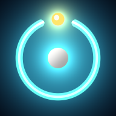
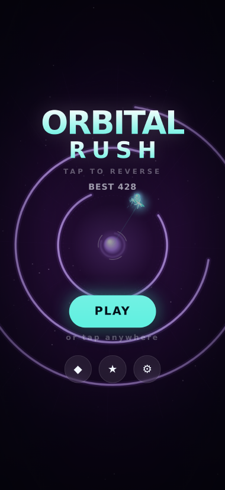
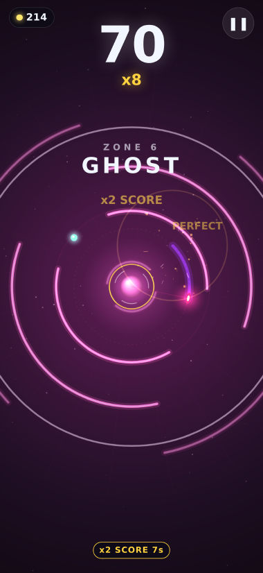
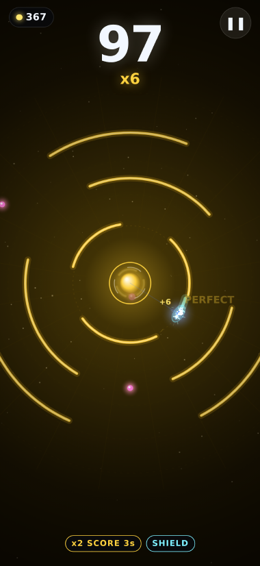
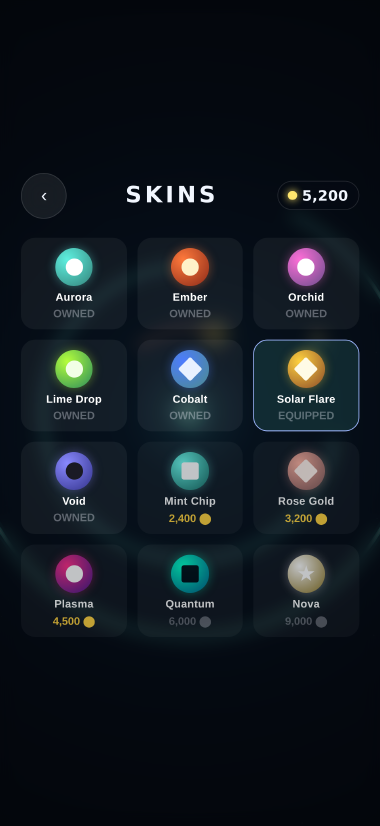

# Orbital Rush

A one-thumb arcade game, complete and ready to submit to the App Store.

You are a spark locked in orbit around a dying star. Rings close in from the
dark, each with one way through. **Tap anywhere to reverse your direction.**
That is the entire control scheme.

<p align="center">
  
</p>

<p align="center">
  
  
  
  
</p>

---

## What is actually here

| | |
| --- | --- |
| **The game** | `www/` — a zero-dependency ES-module web app. No engine, no framework, no bundler. |
| **The native app** | `ios/` — a real Xcode project (Capacitor 8, Swift Package Manager, no CocoaPods). |
| **The art** | `tools/make_icons.py` — every icon and the launch image are generated from code. |
| **The tests** | `tests/` — 41 head-less simulation/meta tests, a 37-check browser end-to-end run, and an 11-check run of the single-file build. |
| **The listing** | `store/` — description, keywords, privacy policy, App Privacy answers, review notes, and generated screenshots. |

No ads, no analytics, no in-app purchases, no accounts, no network calls. The
app runs with the device in airplane mode forever.

---

## Play it right now

```bash
npm install          # only dev tooling; the game itself has no dependencies
npm run dev          # http://localhost:8080
```

Desktop controls: **space / ← / →** reverse, same as tapping.

---

## How the game works

### The loop

You orbit at a fixed radius. Rings shrink toward you. When a ring reaches your
orbit you either slip through a gap or you are out. Every ring is worth a point;
orbs sitting *off-centre inside the gaps* are worth energy.

Two decisions make it more than a reflex test:

* **The greedy line.** Taking an orb means aiming at the orb rather than the
  middle of the gap. Chain orbs and your multiplier climbs to x8. Miss an orb on
  a ring that had one and the chain resets to zero — so greed compounds and so
  does punishment.
* **The perfect line.** Threading a gap dead-centre is a PERFECT and pays a
  bonus. The safest line and the most profitable line are not the same line.

### Why it never feels cheap

This is the part that took the most care.

**Rings are parameterised by travel, not by time.** A ring's rotation, its
pulse, and its gap drift are all functions of how far it has moved inward. That
means the instant a ring spawns, the game already knows exactly where its gap
will be when it arrives, no matter how the speed changes in between.

**What touches you is what kills you.** Collision is continuous over the whole
band where a ring overlaps the player — not a single verdict as the ring
crosses the orbit line. The body that is drawn is the body that collides: a
lens, wide along the orbit and narrow across it, because its radial size is
exactly what decides how long a ring is in contact. Sampling happens at a fixed
resolution in *travel*, never per frame, so the verdict is identical at 60 Hz,
120 Hz or head-less in a test.

**Every ring is passable by construction.** A ring sweeps past you: you keep
orbiting, it keeps rotating, and a drifting gap keeps moving. So the generator
computes two things per ring and refuses to emit anything tighter —

```
reach     = separation × (player angular speed ÷ ring speed) × safety
gap floor = player half-width + sweep/2 + human margin
```

— where `sweep` is everything that moves past you during contact. The first
keeps the next gap inside the arc you can still reach; the second keeps it wide
enough for your swept body to fit, with room left for a human reaction time.
There is no unwinnable ring: difficulty comes from speed, rotation, gap count
and the zone hazards. `tests/world.test.mjs` asserts both invariants directly,
and a reference autopilot (the same code that drives the title-screen attract
mode) has to survive a long run on every seed for the suite to pass.

### The difficulty ramp

| Score | Gap between rings | What changes |
| ----: | ----------------: | --- |
| 0 | 0.95 s | Wide single gaps, slow rotation |
| 25 | 0.76 s | Two-gap rings appear |
| 80 | 0.57 s | Reversing and twin rings |
| 200 | 0.43 s | Three-gap storms, drift, ghost rings |
| 350+ | 0.38 s | Everything at once |

Eight zones cycle every 14 rings, each with its own palette, hazard and musical
key. `npm test` fails if the cadence ever leaves the playable band.

### Audio

There are no audio files. Every sound effect and every note of the soundtrack is
synthesised in WebAudio at runtime, and the music reacts to the run: tempo,
filter brightness and arpeggio density all follow how well you are doing, and
the key changes with the zone.

---

## Project layout

```
www/
  index.html               screens + HUD markup
  styles/main.css          one stylesheet, scales from iPhone SE to iPad
  src/
    engine/                reusable, game-agnostic pieces
      loop.js              fixed 1/120 s timestep, spiral-of-death guard
      input.js             pointer + keyboard, ignores taps on UI chrome
      audio.js             procedural synth: SFX and adaptive soundtrack
      fx.js                pooled particles, shockwaves, shake, floating text
      storage.js           versioned profile, localStorage + native mirror
      haptics.js           Capacitor Haptics -> Vibration API -> silence
      rng.js               seeded mulberry32
      util.js              math/time helpers
    game/
      config.js            all tuning, zones, skins, mission templates
      world.js             the simulation (no DOM — runs in Node)
      render.js            canvas renderer
      meta.js              missions, streak, economy (pure functions)
      autopilot.js         reference player: attract mode + tests
    ui/ui.js               screens, shop, missions, settings, toasts
  sw.js                    offline precache
  manifest.webmanifest     installable as a PWA too
ios/                       Xcode project (see below)
tools/                     icon generator, App Store screenshot renderer
tests/                     unit + end-to-end
store/                     everything App Store Connect asks for
```

---

## Testing

```bash
npm test            # 41 head-less tests: simulation, fairness, economy, assets
npm run test:e2e    # 37 checks in real Chromium at phone/tablet/landscape sizes
npm run test:bundle # 11 checks driving the single-file build off the filesystem
npm run verify      # icons + all three suites
```

The end-to-end run drives the actual game: it boots, plays through the
tutorial, scores, pauses, crashes, checks the result screen, buys from the shop,
claims a daily bonus, reloads to prove persistence, and asserts the layout never
overflows at 320 px wide or in landscape. It also fails on any console error.

`npm run test:e2e` reuses whatever Chromium is already on the machine
(`PLAYWRIGHT_BROWSERS_PATH`, or `CHROMIUM_PATH` to point at a specific binary)
rather than downloading a second copy.

---

## Building the iOS app

Requirements: a Mac, Xcode 15+, and an Apple Developer account. Capacitor 8 uses
Swift Package Manager, so **CocoaPods is not needed**.

```bash
npm install
npx cap sync ios        # copies www/ into the app and refreshes plugins
npx cap open ios        # opens ios/App/App.xcodeproj
```

In Xcode, once:

1. Select the **App** target → *Signing & Capabilities* → pick your Team.
   `PRODUCT_BUNDLE_IDENTIFIER` is `com.orbitalrush.game`; change it to a bundle
   ID you own, and register it at developer.apple.com.
2. Confirm *General* → Deployment target is **iOS 16.0**, devices iPhone + iPad.

Then **Product → Archive → Distribute App → App Store Connect**.

Already configured in this repo so you do not have to:

* App icon (1024 px) and launch image, generated by `tools/make_icons.py`.
* `Info.plist`: status bar hidden, arm64, orientations, arcade category, and
  `ITSAppUsesNonExemptEncryption = false` so the export-compliance question is
  answered at upload time instead of by hand on every build.
* `PrivacyInfo.xcprivacy` declaring no tracking, no collected data, and the
  required-reason code for UserDefaults — wired into the target's Resources
  build phase.
* `MARKETING_VERSION` 1.0.0 / `CURRENT_PROJECT_VERSION` 1.

**Bump the version for every upload:** `MARKETING_VERSION` for a user-visible
release, `CURRENT_PROJECT_VERSION` for every build you send to App Store
Connect, and `CACHE` in `www/sw.js` so returning web players get the new files.

### Regenerating art

```bash
npm run icons        # every icon size, the iOS AppIcon and the launch image
```

That one command is the only source of the artwork: it writes `www/assets/icons/`
*and* the Xcode asset catalogs. It takes about a minute, most of it rendering
the 2732 × 2732 launch image. CI fails if the committed art does not match what
the script produces.

### Screenshots for the listing

```bash
npm run screenshots  # store/screenshots/{6.9-inch,6.5-inch,ipad-13}/
npm run previews     # docs/preview/ — the small images in this README
```

These are captured from the live game at the exact pixel sizes App Store
Connect accepts, using `World#jumpTo()` to reach late zones without playing
there first. The full-resolution set is ~30 MB, so it is generated rather than
committed; only the small README previews are tracked.

---

## Submitting

`store/` contains everything the submission form asks for:

* `metadata.md` — name, subtitle, description, keywords, What's New, categories.
* `privacy-policy.md` — publish this at a public URL and paste the URL in.
* `app-privacy.md` — the exact answers for the App Privacy questionnaire.
* `review-notes.md` — what to paste into the App Review notes field.
* `screenshots/` — generated.

Replace the `orbitalrush.example.com` placeholders with your real support and
privacy URLs before you submit; App Review checks that both load.

---

## Deliberate omissions

Two things a score-chaser often ships with are missing on purpose, and both are
easy to add if you want them:

* **Game Center leaderboards.** Adding them means linking `GameKit`, enabling
  the Game Center capability, and reporting `bestScore` after `commitRun()`. It
  would also mean the app touches an Apple account, which is why the current
  build can honestly claim "no account, nothing collected" and carry a *Data
  Not Collected* privacy label. That trade is yours to make.
* **In-app purchases and ads.** There is no StoreKit or ad SDK anywhere in the
  project. Energy is earned only by playing. If you monetise later, note that
  the App Privacy answers in `store/app-privacy.md` and the copy in
  `store/metadata.md` both promise otherwise and would need rewriting.

## Tuning the game

Almost everything lives in `www/src/game/config.js`:

* `TUNE` — orbit radius, the player's two half-extents, ring speed, spacing,
  the gap margin, chain rules, revive price.
* `ZONES` — palette, gap count, gap width, rotation range and hazard flags.
* `SKINS` — cosmetics and prices.
* `MISSION_TEMPLATES` / `DAILY_REWARDS` — the daily loop.

After a change, run `npm test`: the suite checks the ramp stays playable and
that a competent player can still survive, so it will tell you if a tweak made
the game unfair rather than merely harder.

## Licence

Unlicensed / all rights reserved. This is a shippable product, not a template —
if you intend to publish it, replace the bundle identifier, the support and
privacy URLs, and the contact address in the privacy policy.
